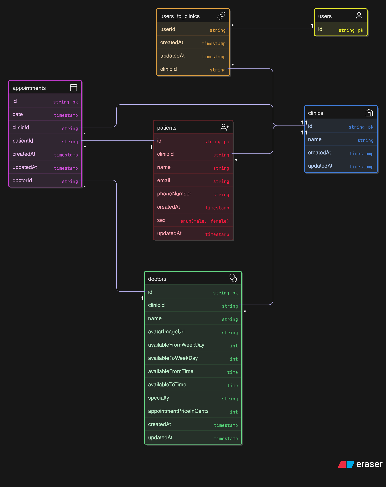

# 🩺 Doutor Agenda


> Sistema de agendamento de consultas para clínicas, com autenticação, gestão de médicos e pacientes, planos e agendamentos.

---

## 🚀 Tecnologias principais

- 🧠 **TypeScript**
- ⚙️ **Next.js** (Frontend)
- 🛠️ **NestJS** (Backend)
- 🧬 **Drizzle ORM** (Banco relacional)
- 🐘 **PostgreSQL**
- 🎨 **TailwindCSS**
- 🔧 **ESLint & Prettier**

---

## 📋 Funcionalidades

- 🔐 Autenticação de usuários
- 🏥 Gestão de clínicas (usuários múltiplos por clínica)
- 👨‍⚕️ CRUD de médicos
- 👥 Cadastro de pacientes
- 📅 Agendamentos médico ↔ paciente
- 💳 Planos de assinatura com controle de preços

---

## 🧠 Modelagem de dados (PostgreSQL)

- 👤 **User ↔ Clinic** (N:N)
- 🏥 **Clinic → Doctors / Patients / Appointments** (1:N)
- 👨‍⚕️ **Doctor → Appointments** (1:N)
- 🧑‍🤝‍🧑 **Patient → Appointments** (1:N)

> Ver `docs/erd.png` para visualização do modelo.

---

## 📦 Estrutura Inicial

```
doutor-agenda/
├── apps/
│   ├── web/           # Frontend Next.js
│   └── api/           # Backend NestJS
├── packages/
│   └── config/        # Shared configs (eslintrc, prettier, tsconfig, etc)
├── prisma/            # Migrações e seed
├── .vscode/
├── .eslintrc.js
├── tailwind.config.js
├── tsconfig.json
└── package.json
```

---

## ▶️ Como executar

```bash
# Clone o projeto
git clone https://github.com/seuusuario/doutor-agenda.git

# Acesse o diretório
cd doutor-agenda

# Instale as dependências
npm install

# Rode a aplicação em modo desenvolvimento
npm run dev
```

> Obs.: verifique se o PostgreSQL está instalado e rodando em sua máquina.

---

## 📍 Roadmap

- [x] Estrutura inicial do projeto
- [ ] Setup do banco com Drizzle
- [ ] Autenticação e cadastro de usuários
- [ ] CRUD de clínicas, médicos e pacientes
- [ ] Agendamento de consultas
- [ ] Integração com planos de assinatura
- [ ] Testes automatizados

---

## 🧠 Banco de Dados

A aplicação utiliza banco de dados relacional hospedado no [NeonDB](https://neon.tech), utilizando o ORM [Drizzle](https://orm.drizzle.team/).

- Banco: PostgreSQL
- ORM: Drizzle ORM
- Arquivos de schema: `src/db/schema.ts`
- Configuração: `drizzle.config.ts`
- Migrations: geradas na pasta `/drizzle`

### 🔄 Relacionamentos modelados

- Usuário ↔ Clínica (N:N)
- Clínica → Médicos, Pacientes, Agendamentos (1:N)
- Médico → Agendamentos (1:N)
- Paciente → Agendamentos (1:N)

### 📊 Diagrama ER

A modelagem pode ser visualizada no diagrama abaixo:




## 🤝 Contribuições

Contribuições são bem-vindas! Sinta-se à vontade para abrir uma [issue](https://github.com/seuusuario/doutor-agenda/issues) ou enviar um PR.

---

## 📄 Licença

Distribuído sob a licença MIT. Veja `LICENSE` para mais informações.
